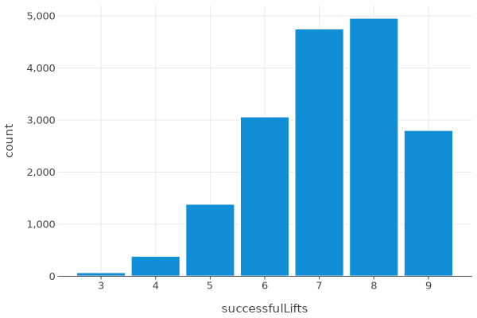
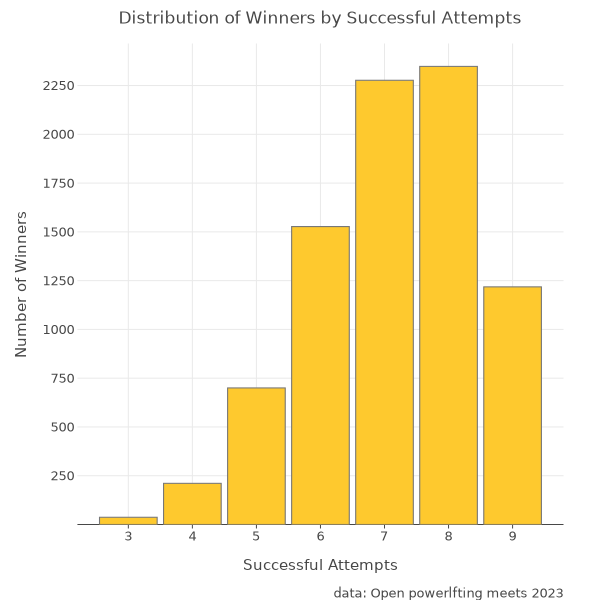

# My First Toe Dip into Data Science with PostgreSQL, Kotlin Notebooks, Dataframe and Kandy

Have you ever wanted to play around with a data set, but the thought of setting up a python development environment seemed like too much of a hassle?

Or was that only me?

In my work, I sit firmly in the Kotlin/JVM ecosystem. And I like it here. I also have a hobby that I am really passionate about: powerlifting. The sport where we wear funny little jumpsuits and try to lift as much as we can for one repetition in the squat, bench press and deadlift.

Powerlifting is somewhat of a niche sport, however it is growing rapidly and has a strong, supportive community. It is also a data-driven sport which has birthed an open source data set, containing the results of powerlifting competitions held all over the world. The full dataset is over 3.3 million rows and counting. I was really interested to see what insights lay inside, but I had never written a line of python before, and didnt feel like dumping 3.3 million rows in excel. It’s also not a very elegant solution for a software engineer.

Wouldn’t it be great to use familiar language and IDE while I learn data science?

Enter Kotlin Notebooks.

Kotlin for data science is nothing new, the JetBrains team having been doing great work there for some time, and the ecosystem just keeps getting better. You have all the building blocks you need to go from questions to answers in a very short time.

Kotlin Notebooks is a plugin you can add to the IDE you’re already familiar with, intelliJ, and can have you inspecting your dataset within minutes. The dataset does not have to be limited to niche hobbies. For example: has “the business” ever asked you a question where you knew you had the data but didn’t know how to turn it into actionable information? Like the rate of adoption of a new feature you launched?

### Getting Started

To get started just add the Kotlin Notebook plug-in from the plug-in marketplace in Intellij.

The next step is to connect your data source. A lot of examples you find online will have you import a csv and manipulate it in-memory as a dataframe. This is a fine approach for smaller datasets (up to 100,000 rows), but for larger datasets it can end up slow and impractical.

The Kotlin Dataframe library provides a number of convenient functions for accessing your datasource and manipulating the results as a dataframe. A dataframe is a tabular data structure, similar to a spreadsheet or an SQL table, consisting of rows and columns. It is a common and powerful abstraction used in data science.

The rest of this article is going to assume that you are following along with the [sample project](https://github.com/adele97/kotlin-notebooks-blog). However if you have a database you'd like to explore, you can of course connect it up and try to draw out your own insights!

The sample project looks at [particpation in the sport of powerlifting in 2023](https://www.kaggle.com/datasets/open-powerlifting/powerlifting-database?resource=download&select=openpowerlifting.csv).

Open up the sample project and take a look at `my-first-notebook.ipynb`

First, we import the Kotlin Dataframe and Kandy libraries.

```kotlin notebook
%use kandy
%use dataframe
```

[Kandy](https://kotlin.github.io/kandy/welcome.html) is an open-source plotting library for Kotlin based on the [lets-plot visalisation library](https://lets-plot.org/). Data is nice, but seeing is believing. Kandy helps us turn rows and columns full of numbners into actionable insights.


But before we can get plotting, we need data. We connect to the containerised Postgres database using a url, username and password. Then we can fetch the contents of the `powerlifting_data` table

```kotlin notebook
val dbConfig = DbConnectionConfig(URL, USER_NAME, PASSWORD)
val data = DataFrame.readSqlTable(dbConfig, "powerlifting_data")
```

Importing the entire table does defeat the purpose of creating a database to begin with, so I would not recommend making this your standard workflow (especially if you have more than 100,000 rows). But for today's exploratory purposes it's a fine place to start. And later I'll show you how to use SQL queries and dataframe together to work more efficently. 

### Understanding the data set

In order to do data science well, you need to understand your data set. Taking the time getting to know your data set helps you avoid making incorrect assumptions and drawing (costly) incorrect conclusions. I cannot stress enough the importance of this step! This is why I started my data science journey with powerlifing. It's a domain I have experienced first hand and it is much more than a data set to me. Let me show you what I mean. 

We can use the `describe()` function from Kotlin Dataframe on the fetched data.

```kotlin notebook
data.describe()
```


The `describe()` function gives us some essential information about our powerlifitng dataset. The column names are listed on the left, in the name column alongside some summary statistics. Using the output we can say

- The data set has 179,227 rows.
- Of those, 104,960 are unique names (lifters).
- Name, sex, event, equipment, place, federation, date, country and meetname are mandatory fields
- All other fields are nullable (potentially empty)
- The most common event is SBD and with minimal equipment (aka Raw)

There are also some other curious things that may not be clear if you do not understand powerlifting
1. The minimum for the squat, bench and deadlift are all negative. This is how a missed lift is represented in the data set. A missed lift is one that was attempted during the competition but was not completed successfully, therefore it does not contribute to the final score, or total for the lifter. This convention makes the mean and median values from the `describe()` function largely useless
2. The entries squat4kg, bench4kg and deadlift4kg have a large number of null values. Fourth attempts are rare, and do not count toward the TotalKg. They are used for recording single-lift records (eg: deadlift world record) and can only be taken under special circumstances. For most purposes, you can leave these values out of your analyses.

### Answering Your First Research Question 

In a powerlifting meet, each competitor attempts three lifts: squat, bench press, and deadlift. They get three attempts per lift, for a total of nine attempts. The heaviest successful attempt in each lift is added together for their total score.

Prevailing powerlifting wisdom tells us that successfully completing all lifts in a powerlifting meet, aka going “9 for 9”, is the best way to have a successful meet. Not just in terms of maximising your chances of a spot on the podium, but also for the mental benefits of achieving what you came for.

So as a powerlifer myself, I was really curious to know. Is it really better to go nine for nine when chasing a win? Or is that YOLO deadlift actually a good idea?

In order to answer this question, we can start by plotting a simple distribution of the number of winners at each number of successful attempts. 

As already mentioned, loading the whole database into memory to perform your analysis is next to impossible if your dataset is very large. So why not use SQL to only load the data that you need?

In order to answer this question, I need to find the lifters who got first place in a meet, and then the number of successful lifts they made. Seems simple enough right?

As datascience practioners, there is no teacher or answer book to tell us whether we are right or wrong. We need to combine our knowldege of the domain with sound data science practices, and be able to defend any conclusions that we make.

In this case, from my experience in powerlifting I know that
- In some compeitions, there is only one lifter per weight class. So they will be awarded first place no matter how poorly they do. So setting a minuimum number of entrants per weight class makes sense
- In the dataset, competitions are unique by `meetname` and `date`
- For a specifc competition, a class is unique not just by `weightclass`, but also by `division` (eg: juniors, open and masters)

So that leads to the following query. You will see that I've filtered out null results in the query, but of course you could do that directly the dataframe using the `filterNulls` function in the dataframe library.

Of course you can just write the string directly, but I like to create a function so you can easily modify the query with placeholders. For example to look at a particular year/s or to quickly iterate on the number of entries (lifters) in a weight class. The ability to quickly iterate, learn and discover is a key componment of a successful datascience workflow.

```kotlin notebook
fun queryByTimePeriodAndEntries(startYear: String, endYear: String, entries: Int) = 
    """
SELECT
    pd.*
FROM
    powerlifting_data pd
        JOIN
    (
        SELECT
            meet_name,
            date,
            weight_class_kg,
            division,
            COUNT(*) AS lifter_count
        FROM
            powerlifting_data
        WHERE
            date BETWEEN '$startYear-01-01' AND '$endYear-12-31'
        GROUP BY
            meet_name, date, weight_class_kg, division
        HAVING
            COUNT(*) >= $entries
    ) AS qualified_classes
    ON me.meet_name = qualified_classes.meet_name
        AND me.date = qualified_classes.date
        AND me.weight_class_kg = qualified_classes.weight_class_kg
        AND me.division = qualified_classes.division
WHERE
me.event = 'SBD'
  AND me.date BETWEEN '$startYear-01-01' AND '$endYear-12-31'
  AND me.squat1_kg IS NOT NULL
  AND me.squat2_kg IS NOT NULL
  AND me.squat3_kg IS NOT NULL
  AND me.bench1_kg IS NOT NULL
  AND me.bench2_kg IS NOT NULL
  AND me.bench3_kg IS NOT NULL
  AND me.deadlift1_kg IS NOT NULL
  AND me.deadlift2_kg IS NOT NULL
  AND me.deadlift3_kg IS NOT NULL
  AND me.best3_bench_kg IS NOT NULL
  AND me.best3_squat_kg IS NOT NULL
  AND me.best3_deadlift_kg IS NOT NULL
  AND place != 'NS'; -- no shows are excluded
    """
```

To run our query, we can use the `readSqlQuery` method provided by the dataframe library. In my experience, I found it a little fussy with white space, so I prefer to create a helper function, which you can find in `util.Helpers`. The helper function is called `fetchResults` a lot, and since it does not change often, we can keep the boilerplate out of our notebook by defining it once and importing it. If the helpers class didn't import, make sure you go to the setting for this notebook and `select modules to use in the notebook`"


So first we build the query using by specifying the startYear, endYear and the minimum number of entries (lifters) per event.

Then we use the helper function to open the database connection, run the query then close the connection

```kotlin notebook
import util.Helpers

val helpers = Helpers()

val query = queryByTimePeriodAndEntries("2023", "2023", 3)
val data = helpers.fetchResults(query)
```
Now that we have the results we can print the the first 10 rows of the results using the `head` function. This is a good habit to get into so you can check as you go that your results make sense, and can identify any errors or curiousities early on. We could also run the `describe` function again to confirm the number of rows, and that we correctly removed null values for our 9 lifts (squat1kg, squat2kg, squat3kg, bench1kg, etc.)

```kotlin notebook
data.head(10)
data.describe()
```
With this filtered raw data, we can use the dataframe library to collect our results into a frame of two columns: `successfulLifts` and `count`.

As discussed earlier, a positive value for a lift indicates that is was successful. If it is negative, the lift was attempted but it was ruled a "no lift" and not counted towards the total or final score for the lifter.

```kotlin notebook
val successfulLifts by column<Int>()
val count by column<Int>()

val columns = listOf(
    data.squat1kg, data.squat2kg, data.squat3kg,
    data.bench1kg, data.bench2kg, data.bench3kg,
    data.deadlift1kg, data.deadlift2kg, data.deadlift3kg
)

fun addNumberOfSuccessfulLifts(data: DataFrame<Line_15_jupyter._DataFrameType>, firstPlaceOnly: Boolean = true): AnyFrame {

    val df = if (firstPlaceOnly) data.filter { it.place == "1" } else data
    
    return df.add(successfulLifts) {
        columns.count { value -> it[value] > 0 }
    }
        .groupBy { it[successfulLifts] }
        .aggregate {
            count() into count
        }
        .drop { it[successfulLifts].equals(0) || it[successfulLifts].equals(1) || it[successfulLifts].equals(2) }
        .sortBy(successfulLifts)
}
```

Here's a simple breakdown of what `addNumberOfSuccessfulLifts` does:

1. Counts successful lift attempts:
   - It looks at nine columns `squat1kg`, `squat2kg`, `squat3kg`, `bench1kg`, etc.
   - If a value is greater than 0, it's considered a successful attempt.
   - It counts the number of successful attempts for each row and stores it in a new column called `successfulLifts`.
2. Groups the data by the number of `successfulLifts`.
3. Uses the `aggregate` function to count how many rows fall into each `successfulLifts` group (creating a `count` column).
4. Removes any anamolous rows where lifters have 0, 1, or 2 successful lifts.
5. Sorts the remaining data by `successfulLifts` in ascending order.

To confirm that the function does as intended, we can print the results and inspect them. The `head` function is not necessary as the dataframe is small, but you can use it out of habit and if ask for more rows than exist in the dataframe it will just return what it has, in this case 7 rows.

```kotlin notebook
winnersDataFrame // OR
winnersDataFrame.head(10)
```

### Plotting your Results with Kandy

Now the fun can begin... plotting our results with Kandy 🥳

Kandy is a declarative plotting library for Kotlin that allows for easy and intuitive data visualisation. And lucky for us that Kandy and DataFrame are a match made in heaven.

Kandy makes use of code blocks to define plot elements, and supports custom styles, themes, and layout adjustments.

Let's start with a simple bar chart to visualise how the distribution of winners at each number of successful lift attempts. All we need to do is specify which column to map to the x axis and which to map top the y axis!

```kotlin notebook
plot(winnersDataFrame) {
    bars {
        x(successfulLifts) 
        y(count)
    }
}
```
Which gives us



Plotting in this simple fashion will make use of default formatting, and will use axes labels that are the same as the data frame accessors. This is not ideal, so we can customise it at bit more. And while it looks like a lot of code, its declarative nature makes it easy to follow.

```kotlin notebook
kandyConfig.themeApplied = false

plot(winnersDataFrame) {

    bars {
        x(successfulLifts)
        y(count) {
            axis.name = "Number of Winners"
            axis {
                breaks(listOf(500,1000,1500,2000,2500,3000,3500,4000,4500,5000), format = "d")
            }
        }
        fillColor = Color.hex("#fec92e")
        borderLine {
            color = Color.hex("#777777")
            width = 0.5
        }
    }
    layout {
        title = "Distribution of Winners by Successful Attempts"
        caption = "data: Open powerlfting meets 2023"
        size = 600 to 300 // default is 600 to 400
        xAxisLabel = "Successful Attempts" // alternative to axis.name used for the y axis
        style {
            global {
                text {
                    fontFamily = FontFamily.custom("Helvetica Neue")
                }
                plotCanvas {
                    title {
                        hJust = 0.5 // centre the title
                        margin = Margin(10.0)
                        fontSize = 17.0
                    }
                    caption {
                        hJust = 1.0 // align right
                        margin = Margin(10.0, 0.0, 0.0, 0.0)
                    }
                    margin = Margin(0.0, 30.0, 0.0, 5.0)
                }
            }
        }
    }
}.save("distribution-of-winners-custom-formatting.svg")
```

As you can see we have added a title, axis labels, changed the font, centred the title and set some margins. We also set custom axis intervals, or breaks at multiples of 500.

Tip: Kotlin notebooks will apply your chart formatting on top of your IDE theme. So to see what your chart will look like when exported with `.save()` function, you can set `kandyConfig.themeApplied = false`

And so with some small changes our chart now looks like this



Looking at this chart it may be tempting to conclude that actually going "8 for 9" is the superiror strategy in a powerlifting meet. This stumped me for a few minutes as well until I realised that lifters that go 9/9 are a special breed, and are probably just simply out-numbered. So let's do the visualisation again to answer the question:

#### _Out of all lifters that achieve X number of successful attempts, what percentage of those get first place?_

You may have spotted already the `firstPlaceOnly` boolean in the `addNumberOfSuccessfulLifts` function. By default it is set to true. Now we can call the function again on our dataframe with `firstPlaceOnly` set to `false`, so that we get the distribution of successful attempts for all lifters

```kotlin notebook
val allLiftersDataFrame = addNumberOfSuccessfulLifts(data, false)
```

We can now merge the two dataframes `winnersDataFrame` and `allLiftersDataFrame` into a new dataframe `dfRatioWinners` and calculate the proportion of winners at each number of successful attempts.

```kotlin notebook
val dfRatioWinners =
    dataFrameOf(winnersDataFrame.rename(count).into(winners).columns() + allLiftersDataFrame.select(count).rename(count).into(allLifters).columns())
        .add(ratioWinners) {
            (it[winners].toDouble() / it[allLifters].toDouble()) * 100.0
        }
```

Here's what the code does

- Renames the `count` column in winnersDataFrame to `winners`
- Selects and renames `count` in allLiftersDataFrame to `allLifters`. The select is important as otherwise you are attempting to add the column `successfulLifts` into your new dataframe twice, which will throw a runtime error.
- Combines both into the new dataframe.
- Adds a new column `ratioWinners` 
- Calculates `winners` as a percentage of `alllifters`. They are each casted to a double so that the division of `Int` is not rounded to zero before being multipled by 100 (don't ask me how long it took me to spot this bug the first time 😉)

If we print the resulting dataframe we have

```kotlin notebook
dfRatioWinners
```


Plotting this with Kandy, allows us to identify any trend a little easier. You can see this time I've assinged the plot to a variable. I prefer this as it provides a little more flexibility in saving the plot or making use of multiplots such as `plotBunch` or `plotGrid` (more on this later)

```kotlin notebook
val plotRatioWinners = plot(dfRatioWinners) {

    bars {
        x(successfulLifts) 
        y(ratioWinners) {
            axis.name = "percentage"
            axis {
                breaks(listOf(5,10,15,20, 25), format = "{.0f}%")
            }
        }
        fillColor = Color.hex("#fec92e")
        borderLine {
            color = Color.hex("#777777")
            width = 0.5
        }
    }
    layout {
        title = "Percentage of First Places by Successful Lifts"
        subtitle = "at least 3 lifters in weight class"
        caption = "data: Open powerlfting meets 2023"
        size = 600 to 300
        xAxisLabel = "Successful Attempts"
        style {
            global {
                text {
                    fontFamily = FontFamily.custom("Helvetica Neue")
                }
                plotCanvas {
                    title {
                        hJust = 0.5
                        margin = Margin(10.0)
                        fontSize = 14.0
                    }
                    subtitle {
                        hJust = 0.5
                        margin = Margin(5.0)
                        fontSize = 11.0
                    }
                    caption {
                        hJust = 1.0
                        margin = Margin(10.0, 0.0, 0.0, 0.0)
                    }
                    margin = Margin(5.0, 30.0, 20.0, 5.0)
                }
            }
        }
    }
}

plotRatioWinners
```


### Comparing Multiple Plots with plotBunch

To compare both charts you can use `plotBunch` or `plotGrid`. I prefer `plotBunch` as I find it provides a bit more control as you can specify exactly how you want your charts arranged. 

```kotlin notebook
plotBunch {
    add(plotWinners, 0, 0, 600, 300) // top x position, top y position, width, height
    add(plotRatioWinners, 0, 300, 600, 300) // top y position set to height of chart on top (300)
}
```


### Answering the Research Question

Now that we have removed the bias due to different group sizes, the story in now a little clearer and lends support to the hypothesis that going "9 for 9" increases your chances of winning.
Although there were far more winners in 2023 that went 8/9 over 9/9, when we look at the percentage of lifters that went 9/9 that won, we see that the rate of winning is 26.5% in the 9/9 group compared to 25.8% in the 8/9 group.

So is this it? Does this mean we can say for certain that going "9 for 9" is always better? Not quite. We can still improve our analysis by

- Trying to replicate this finding over a longer time eg: 5 years or 10 years
- Trying to see if this finding holds for 5 or 10 competitors per weight class
- Trying to find if this holds at the elite level (elite level can be inferrred by filtering on the value in the `federation` column. For example if the federation is 'IPF', then these are international competitions)

Data Science is as much about story telling as it is about data. Call me old fashioned, but what we are calling AI in 2025 is really just supercharged data science. The models and methods driving the development of LLMs have their foundation in data science.
This is why it's important to be critical of these models and the stories that they are telling you. Ask any seasoned data scientist and they will tell you just how easy it is to make a mistake and draw an incorrect conclusion.

The way that we can guard against costly mistakes is not just a sound understanding of data science basics, but also by understanding the domain that we are operating in. 

Earlier I mentioned the importance of having a quick and iterative workflow. The reason for this is so that we can run multiple simulations quickly, test assumptions and get feedback. To really build a deep and intimate knowledge of our data set.

Kotlin Notebooks, DataFrame and Kandy work seemlessly together to allow us to do just that. By working in a familiar development environment of IntelliJ, and connecting to an external data source, we can start to interact with our data right away. Learning and discovering within minutes.


